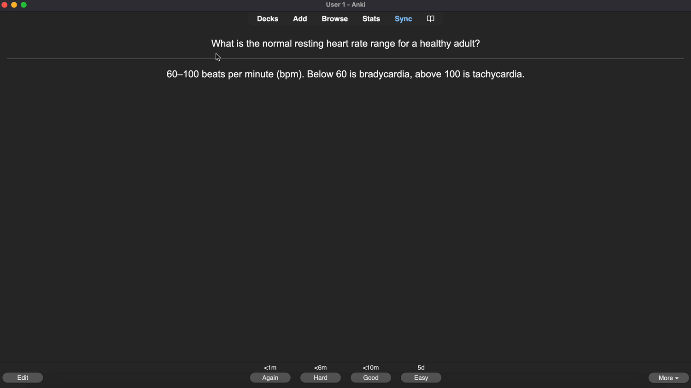
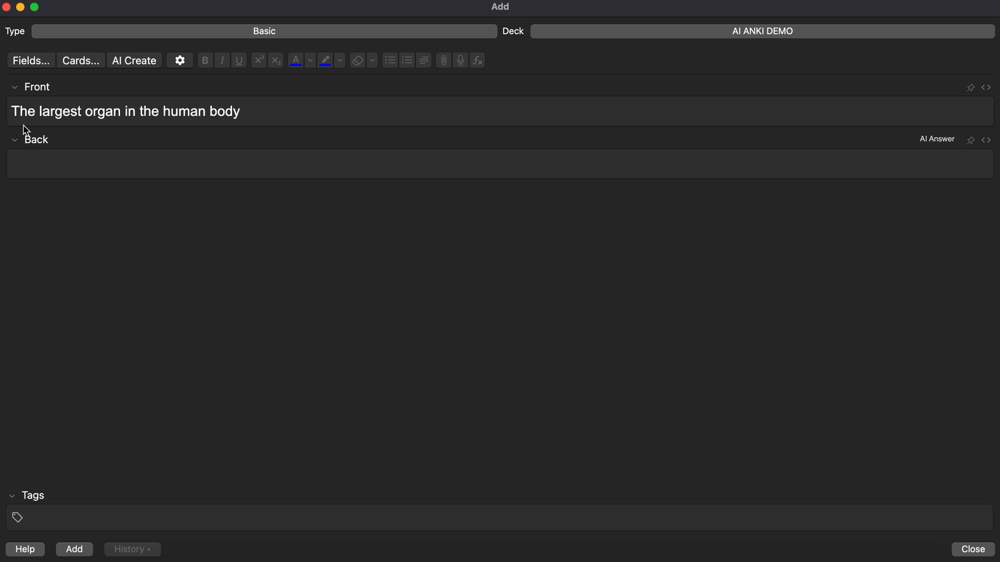
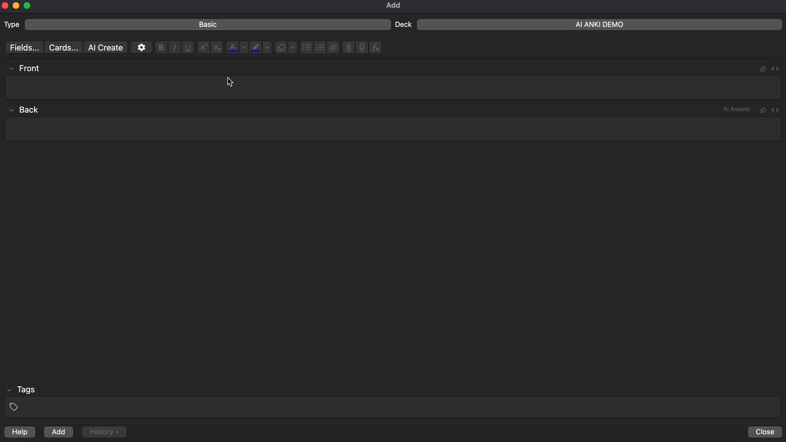

# Anki Copilot

**A 100% free AI study tool for medical students, doctors, and healthcare professionals.**
Powered by OpenEvidence AI for evidence-based answers.

## Overview
Anki Copilot adds AI superpowers to Anki. Generate full decks from your notes, get instant explanations on what you're studying, auto-fill card answers, and chat with a medical AI — all without leaving Anki.

*   **Free** for the healthcare community. No subscriptions, no limits.
*   **Real Citations**: Answers link to peer-reviewed sources like JAMA and PubMed.
*   **Works Inside Anki**: Everything happens in the side panel or editor. No tab-switching.
*   *(Requires internet connection)*

---

## Features

### 1. Create a Whole Deck
Paste your notes or describe a topic. Anki Copilot generates a full deck of flashcards in seconds — review them, pick the ones you like, and save them with one click.

### 2. Explain Anything
Highlight any word or phrase on a flashcard and click the floating **Explain** bubble. Get an instant 2-sentence breakdown right on the card, without opening the side panel.

### 3. Auto-Fill Card Answers
Type the front of a new card, click **AI Answer**, and the back gets filled in automatically with a concise, accurate answer. Great for building decks fast.

### 4. Sidebar Chat
Click the book icon to open the side panel. Ask any medical question and get a detailed answer with direct links to the primary literature.

### 5. Make a Single Card
Open the **Add Cards** dialog, click **AI Create**, and paste any content. Get a clean Front/Back flashcard in seconds — perfect for one-off additions while you study.

---

## Installation

1.  Open Anki.
2.  Go to **Tools** > **Add-ons** > **Get Add-ons**.
3.  Paste the code: `1314683963`
4.  Restart Anki.
5.  Click the **Book Icon** in the toolbar to start studying.

---

## Support

Have an idea or found a bug?
*   [Feature Request](https://github.com/Lukeyp43/anki-copilot/issues/new?labels=feature%20request)
*   [Bug Report](https://github.com/Lukeyp43/anki-copilot/issues/new?labels=bug)

---

**Privacy:** This add-on collects anonymous usage analytics (platform, features used, IP for rate limiting). No personal data or card content is sent.

**License:** Proprietary — see [LICENSE.txt](LICENSE.txt). Free to install and use, but source code may not be copied, modified, or redistributed without permission.
