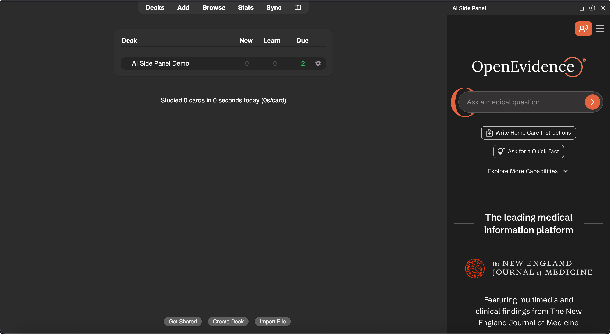

# Anki Copilot

**A 100% free AI study tool for medical students, doctors, and healthcare professionals.**
Powered by OpenEvidence AI for evidence-based answers.

## Overview
Anki Copilot adds AI superpowers to Anki. Generate full decks from your notes, create cards from any topic, get instant explanations on what you're studying, and chat with a medical AI — all without leaving Anki.

*   **Free** for the healthcare community. No subscriptions, no limits.
*   **Real Citations**: Answers link to peer-reviewed sources like JAMA and PubMed.
*   **Works Inside Anki**: Everything happens in the side panel or editor. No tab-switching.
*   *(Requires internet connection)*

---

## Features

### 1. Chat with AI
Open the side panel (click the book icon) and ask any medical question. Get detailed answers with direct links to the primary literature.

### 2. Explain Anything
Highlight any word or phrase on a flashcard and click the floating **Explain** bubble. Get an instant 2-sentence breakdown right on the card, without opening the side panel.

### 3. AI Create
Open the **Add Cards** dialog, click **AI Create**, and paste your content. Anki Copilot generates a clean Front/Back flashcard in seconds.

### 4. AI Generate
Open the deck browser, click **AI Generate**, and paste your notes or describe a topic. Anki Copilot generates a full deck of flashcards — you review and save them with one click.

### 5. AI Answer
Typing out a new flashcard? Just fill in the **Front**, click **AI Answer**, and the back gets filled in automatically with a concise, accurate answer.

---

## Customization

### Templates
Save prompts you use often as keyboard shortcuts. We included 3 starters:
*   **Standard Explain** (`Ctrl+Shift+S`): "Can you explain this to me?" with the card's front and back
*   **Front/Back** (`Ctrl+Shift+Q`): Sends just the front of the card
*   **Back Only** (`Ctrl+Shift+A`): Sends just the back of the card

You can add, edit, or remove templates in **Gear Icon > Templates**.

### Feature Toggles
Turn individual features on or off at any time:
1.  Open the side panel.
2.  Click the **Gear Icon** > **Quick Actions**.
3.  Toggle features like the **Explain** bubble on and off.

---

## Installation

1.  Open Anki.
2.  Go to **Tools** > **Add-ons** > **Get Add-ons**.
3.  Paste the code: `1314683963`
4.  Restart Anki.
5.  Click the **Book Icon** in the toolbar to start studying.

---

## Support

Have an idea or found a bug?
*   [Feature Request](https://github.com/Lukeyp43/anki-copilot/issues/new?labels=feature%20request)
*   [Bug Report](https://github.com/Lukeyp43/anki-copilot/issues/new?labels=bug)

---

**Privacy:** This add-on collects anonymous usage analytics (platform, features used, IP for rate limiting). No personal data or card content is sent.

**License:** Proprietary — see [LICENSE.txt](LICENSE.txt). Free to install and use, but source code may not be copied, modified, or redistributed without permission.
